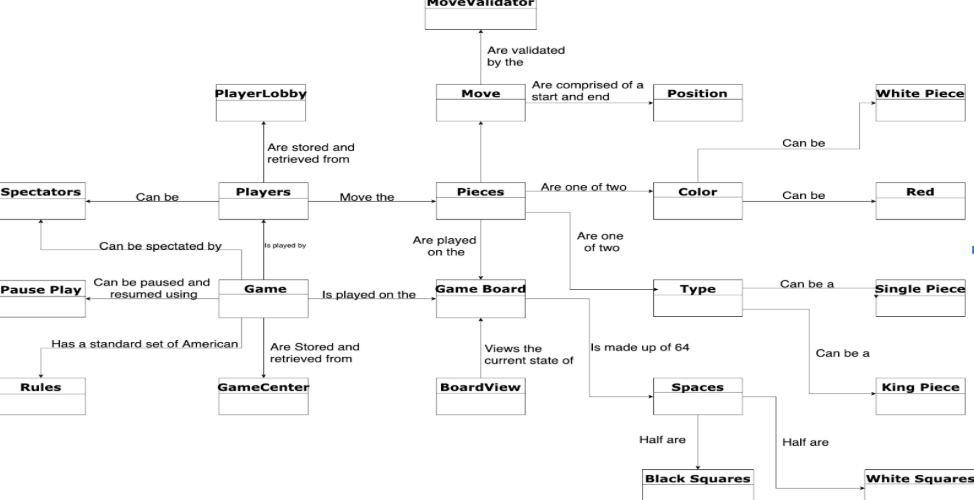
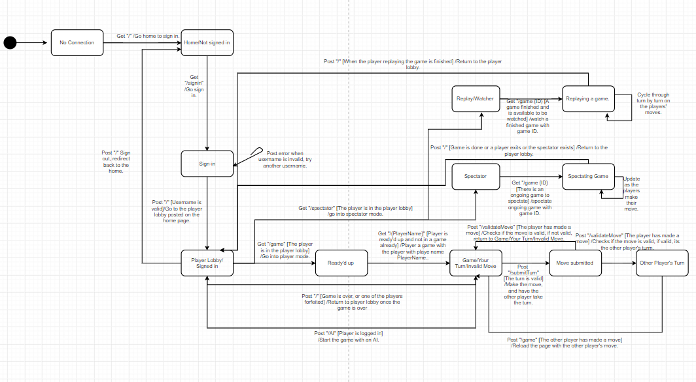
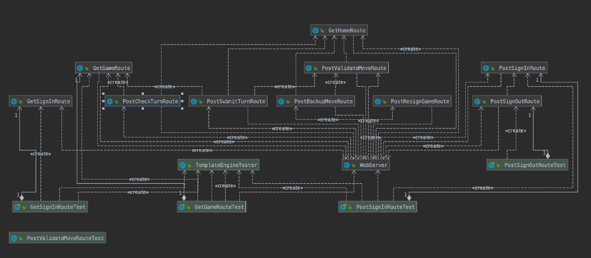
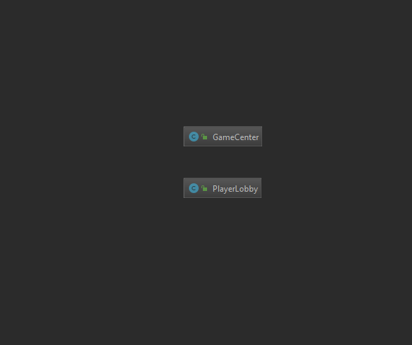
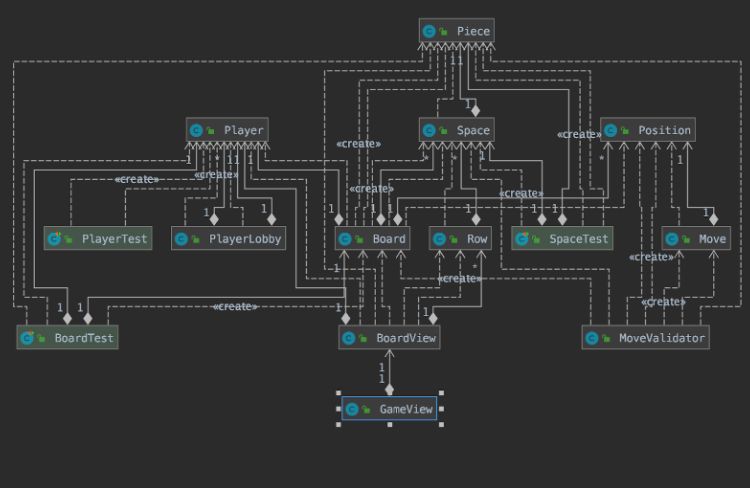

# PROJECT Design Documentation

## Team Information
* Team name: Team C Dawgs and Cats
* Team members
  * Aaron Schaefer
  * An Chang (Mark)
  * Ries Scerbin
  * Gavin Burris
  * Zachary Hahn

## Executive Summary

### Purpose
This Project is a web based checkers game that is played in a browser.
Players can login in and play checkers against each other.

### Glossary and Acronyms

| Term | Definition |
|------|------------|
| VO | Value Object |
| MVP | Minimum viable product|

## Requirements

### Definition of MVP
1. Every player must sign-in to play a game and should be able to sign out after.
2. Two players should be able to play a game of checkers following the American rules.
3. Either player can resign from the game at any moment.

### MVP Features
* Sign-in/out
* Start a Game
* Move Pieces
* Move Validation
* Take Pieces
* Resign

### Definition of Enhancement
1. Players will have the option to spectate any ongoing game.
2. Player will be able to reply any game that has ended (either resigned or won).
3. Player will be able to play vs AI.

### Enhancement Features
* Player vs AI
* Spectate ongoing game.
* Reply ongoing game.

### Roadmap of Enhancements

The enhancements we decided to include within the project are: Replay, Spectator, and AI.
The replay would allow any user that is signed in to view any games that had been completed
during the time the server was started. Spectator allowed any signed in user to view a current
game from either of the player's perspectives. AI lets you place against an artificial intelligence
with the ability to play against the user. All three of these enhancements were completed with Sprint 3
 
## Application Domain

There are many inter-layered elements within the domain model, however, 
the MVPs can be classified into: game pieces, game board/logic, game session, 
and players related attributes. The only enhancement within this tier is the AI logic.

## Architecture and Design

Our project is designed to operate through three different tiers that control the webpage: UI tier, Application tier,
and Model tier. The UI tier handled webpage generation based on requests and responses from the server.
The Application tier contained code that controlled the interpretation of players and games within the context
of the current server that is being run. The Model tier handled all the class that were used
to represent the models the game would need such as the board, pieces, rows, and positions, as well as the logic and
game mechanics of a normal game of checkers.

### Summary

The following Tiers/Layers model shows a high-level view of the webapp's architecture.

As a web application, the user interacts with the system using a
browser.  The client-side of the UI is composed of HTML pages with
some minimal CSS for styling the page.  There is also some JavaScript
that has been provided to the team by the architect.

The server-side tiers include the UI Tier that is composed of UI Controllers and Views.
Controllers are built using the Spark framework and View are built using the FreeMarker framework.  The Application and Model tiers are built using plain-old Java objects (POJOs).

Details of the components within these tiers are supplied below.

### Overview of User Interface

This is how the user views and interacts
with the WebCheckers application.

The user begin in the home page, "/", the user proceeds to "/signin" to 
sign in to player the game. Afterwards, they have an option to playe vs player, play vs AI,
spectate an ongoing game, or reply a game that has ended. They begin the 
game if another player (or against the AI if they choose) is present, during which they will be redirected 
to "/game". "/validateMove" and "/submitMove" were used to validate and 
move the pieces. After a player win, or when a player resigns, the game is 
re-directed back to the player lobby. The player can then choose any mode again. Game ID & Mode
are used to keep track of the games and which mode the player is on.

### UI Tier
The Server-side UI tier of the architecture is illustrated below. Elements
are used to handle different routes, whether it is posting or handling. 
GetHomeRoute and PostHomeRoute, alongisde PostSignInRoute are used when the
application is in the state of the player lobby. GetSignIn and PostSingOut routes 
are used when the player is signing into or signing out of the player lobby. 
PostSubmitTurnRoute, PostValidateMoveRoute are used to validate the moves, while 
other routes are for enhancement features (AI, spectator, reply).

### Application Tier
The Application Tier package was originally unused until we started developing
a game center and moved our PlayerLobby into it. Originally our code only focused
on one game, now it can have multiple going on at once. The GameCenter class keeps
games indexed by the players in the game in an array. The PlayerLobby was moved into
the Application Tier it still behaves the same, managing the players in arrays and moving
players in and out of games. As the project continues the Application tier will likely grow.

### Model Tier
The Model Tier package contains all of the classes relating to Board
creation. The model tier has everything within it that a game needs.
It has the game itself which speaks to the board which has fields 
made up of many of the other classes. This includes Space, Player,
Piece, and a List of Positions. The Space class represents a square 
on the board, Player class represented a user playing a game, Piece class
contains the piece objects that will populate the board when a game is started.
Finally the list of positions is kept to keep track of the pieces that have been
taken during the course of a game. Move is a new class that is responsible for 
the moves the pieces will be making during a game. The Position class was recently
made to  track the moves that were being made and help the MoveValidator class the 
position can track a piece's location in an individual space in a row on the board
and its movement due to user interaction. The MoveValidator did exactly that it 
provided the logic of the piece movement, restricting pieces to move in on legal 
ways but also to create forceful taking of the opponent which is part of the MVP. 
Although there is a King Class it is empty and does nothing. For the enhancement,
an AI class was added to handle the AI logic.

### Design Improvements
The design itself doesnt not have any significant issues. The backend logic does
require some adjustment. One improvement could be more use of polymorphism, which 
makes the code easier to adjust in the future. However, knowing the usage and the
length to which the code will be used, polymorphism was deemed unnecessary.

## Testing
In order to check our code in multiple situations, the situations needed to be simulated. To do this
tests for every class were made checking differing exceptions and errors that could occur, however unlikely.
Several exceptions and errors were simulated for all of the code in this project. Object creation, interaction, and insertion
were all tested.

### Acceptance Testing
All stories within the sprint 1 passed acceptance testing; minor issue was experienced
while attempting to run the application on Windows based machines, however it was fixed.
Minor issues were also experienced during sprint 2, where make move occasional throw 
errors, likely due to an error caused by json. The king piece is not fully functional,
and is being moved to sprint 3. All criteria were met for testing during sprint 3, and final product was 
released/published.

### Unit Testing and Code Coverage
Major issues were experienced during unit testing, and is in the process of being 
polished up with the help of the TA. Code coverage for sprint 1 has all passed, however,
the code coverage is still relatively low. Sprint 2 unit testing was not much better,
as some tests were not fully passing and not all unit tests are complete.. Unit testing for Sprint 3
went relatively well. The application tier received 77% coverage, an relatively good amount for the application
tier. The model tier received 37% coverage, which can be improved to be 75% plus. Issues were experienced with
testing the UI tier, with the code coverage only at a mere 7%. This is due to errors encountered while attempting to
call the when().thenAnswer().
